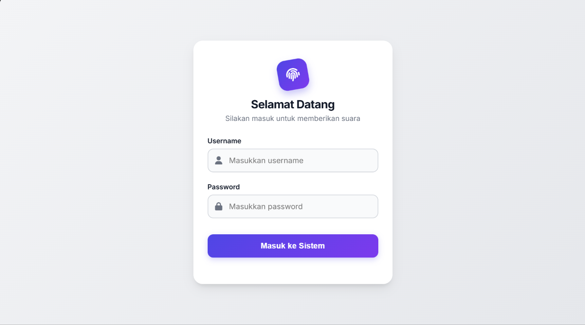
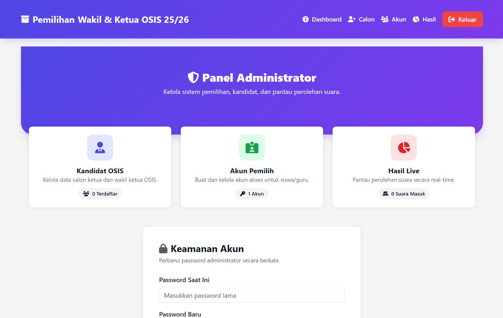
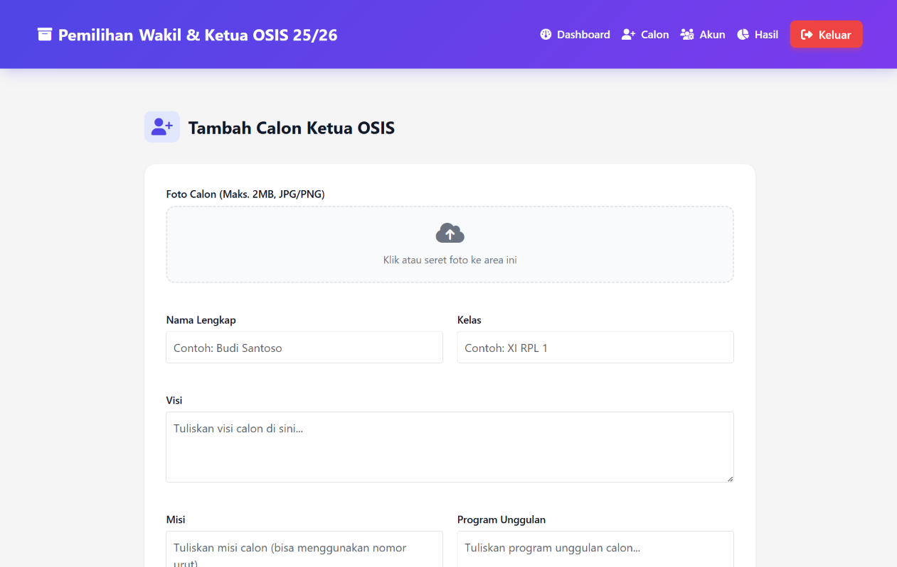

<h1 align="center">🗳️ Pilketos Web App</h1>

  <i>Sistem Pemilihan Ketua OSIS Digital Berbasis Web</i> 
  Dibangun menggunakan <b>PHP</b>, <b>HTML</b>, <b>CSS</b>, dan <b>JavaScript</b>

---

## 📖 Deskripsi

**Pilketos Web App** adalah sistem pemilihan ketua OSIS berbasis web yang dirancang untuk mempermudah proses pemungutan suara secara digital di lingkungan sekolah.  
Website ini memiliki sistem autentikasi multi-role untuk **Admin**, **Guru**, dan **Siswa**.

---

## ⚙️ Fitur Utama

- 🔐 **Multi-role Login System**  
  Role admin, guru, dan siswa dengan sambutan berbeda:  
  - Guru → *Selamat datang, Guru!*  
  - Siswa → *Selamat datang, Siswa!*  

- 📋 **Halaman Voting Interaktif**  
  Menampilkan:
  - Foto kandidat  
  - Visi & misi  
  - Program kerja unggulan  
  - Tombol **Vote**  

- 🧮 **Dashboard Admin**  
  - Ubah password  
  - Tambah akun (guru/siswa)  
  - Tambah/ubah data paslon  
  - Lihat hasil voting dalam bentuk **diagram dan tabel real-time**  

- 💬 **Halaman Edukatif & Motivatif**  
  Menampilkan deskripsi dan pesan untuk mendorong partisipasi siswa dalam demokrasi sekolah.

---

## 🧠 Tujuan Pengembangan

Proyek ini bertujuan untuk:
- Mendigitalisasi proses pemilihan ketua OSIS  
- Meningkatkan transparansi dan efisiensi pemungutan suara  
- Melatih kemampuan pengembangan **web full-stack sederhana**  
- Mengimplementasikan autentikasi, CRUD, dan visualisasi data  

---

## 🛠️ Tech Stack

| Kategori | Teknologi |
|-----------|------------|
| **Frontend** | HTML, CSS, JavaScript |
| **Backend** | PHP (Native) |
| **Database** | MySQL |
| **Hosting** | Sebelumnya dihosting di server sekolah selama periode Pilketos |

---

## 🖼️ Preview

> 

>   
>   
>   
> 

---

## 👥 User Guide

<h2>Local Instalation</h2>
<ol>
	<li>Download Laragon/XAMPP/AMPPS atau sejenisnya dan install</li>
	<li>Jalankan <b>Apache</b> dan <b>Mysql</b></li>
	<li>Copy File <b>Website-pilketos.zip</b> ke Folder <b>C://xampp/htdocs/</b>, <b>C://laragon/www/</b>, <b>C://ampps/www/</b> lalu extract</li>
</ol>
 
<h2>Creating Database</h2>
<ol>
	<li>Masuk ke Browser kemudian tulis di Address Bar http://localhost/phpmyadmin</li>
	<li>Buat Database dengan Nama <b>pemilihan_osis</b></li>
	<li>Import Database <b>pemilihan_osis.sql</b> <a href="https://www.domainesia.com/panduan/cara-import-database-mysql-di-phpmyadmin/" target="_blank">Tutorial Disini</a></li>
</ol>
 

<h2>Akses Aplikasi</h2>
<b>Akses Admin</b>
<ul> 
	<li>Masuk ke Browser kemudian tulis di address bar <b>http://localhost/pemilihan_osis/</b></li>
	<li>Login dengan menggunakan <b>Username = admin</b> dan <b>Password = admin</b></li> 
</ul>
<b>Akses User </b>
<ul> 
	<li>Masuk Ke Browser kemudian tulis di address bar <b>http://localhost/pilketos</b></li>
	<li>Login dengan menggunakan <b>Username dan Password </b>yang telah di INPUT oleh Admin sebelumnya</li>
</ul>

## 🧑‍💻 Pengembang

**Sakti Arif Dwi Putra**  
💼 *Backend & Fullstack Developer (Entry Level)*  
📍 Indonesia  

---

  © 2025 Pilketos Web App — Dibuat untuk digitalisasi pemilihan OSIS sekolah

